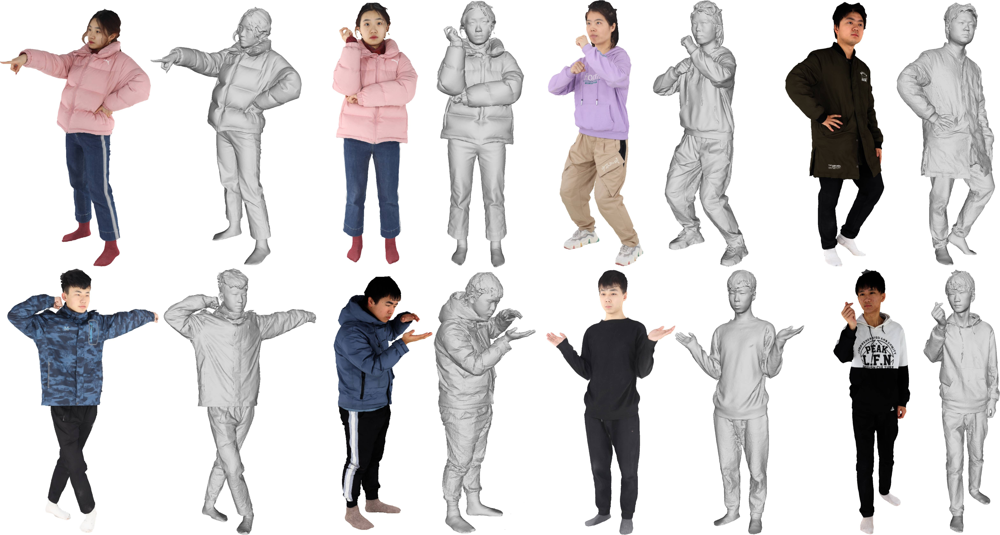

# THUman2.0 Dataset
## Function4D: Real-time Human Volumetric Capture from Very Sparse RGBD Sensors
Tao Yu, Zerong Zheng, Kaiwen Guo, Pengpeng Liu, Qionghai Dai, Yebin Liu.  CVPR 2021 Oral

[[Project Page]](http://www.liuyebin.com/Function4D/Function4D.html)
[[Youtube Video]](https://www.youtube.com/watch?v=-rWUn4fEQNU&t=90s)




## Update 2024.03.02
THuman2.1 is nearly finished! 
We've significantly extended the dataset from 500 models to 2500 models. 
[Comming Soon]


## Agreement

1. The THUman2.0 dataset (the "Dataset") is available for **non-commercial** research purposes only. Any other use, in particular any use for commercial purposes, is prohibited. This includes, without limitation, incorporation in a commercial product, use in a commercial service, as training data for a commercial product, for commercial ergonomic analysis (e.g. product design, architectural design, etc.), or production of other artifacts for commercial purposes including, for example, web services, movies, television programs, mobile applications, or video games. The dataset may not be used for pornographic purposes or to generate pornographic material whether commercial or not. The Dataset may not be reproduced, modified and/or made available in any form to any third party without Tsinghua University’s prior written permission.

2. You agree **not to** reproduce, modified, duplicate, copy, sell, trade, resell or exploit any portion of the images and any portion of derived data in any form to any third party without Tsinghua University’s prior written permission.

3. You agree **not to** further copy, publish or distribute any portion of the Dataset. Except, for internal use at a single site within the same organization it is allowed to make copies of the dataset.

4. Tsinghua University reserves the right to terminate your access to the Dataset at any time.


## Download Instructions 

The dataset is encrypted to prevent unauthorized access.

Please fill the [request form](./THUman2.0_Agreement.pdf) and send it to Yebin Liu (liuyebin@mail.tsinghua.edu.cn) and cc Tao Yu (ytrock@126.com) to request the download link. 

By requesting for the link, you acknowledge that you have read the agreement, understand it, and agree to be bound by them. If you do not agree with these terms and conditions, you must not download and/or use the Dataset.


## Data Explanation

THuman2.0 Dataset contains 500 high-quality human scans captured by a dense DLSR rig.
For each scan, we provide the 3D model (****.obj) along with the corresponding texture map (material0.jpeg).

Update: We have released SMPL-X fitting parameters and corresponding meshes, you can download it from [Here](https://drive.google.com/file/d/1rnkGomScq3yxyM9auA-oHW6m_OJ5mlGL/view?usp=sharing). 

Update: The SMPL fitting results can be downloaded at [Here]( https://dataset.ait.ethz.ch/downloads/gdna/THuman2.0_smpl.zip), many thanks [Dr. Jinlong Yang](https://is.mpg.de/~jyang) and [Dr. Xu Chen](https://ait.ethz.ch/people/xu/) for the efforts. 


Note: When generating the mesh of SMPL-X, please first *scale* the generated SMPL-X mesh (using the original SMPL-X code) and then *translate* the model using global transformation in the pkl, (e.g., SMPLX_Verts * scale + trans).  

## Data Rendering

Please check [ICON/docs/dataset.md](https://github.com/YuliangXiu/ICON/blob/master/docs/dataset.md) to render RGB/Normal/Depth for both scans and SMPL-X fits, and [ICON/docs/training.md](https://github.com/YuliangXiu/ICON/blob/master/docs/training.md#prerequirement) to visualize them with [vedo GUI](https://vedo.embl.es/) interactively.

<details><summary>Please consider cite <strong>ICON</strong> if it also helps on your project</summary>

```bibtex
@inproceedings{xiu2022icon,
  title     = {{ICON}: {I}mplicit {C}lothed humans {O}btained from {N}ormals},
  author    = {Xiu, Yuliang and Yang, Jinlong and Tzionas, Dimitrios and Black, Michael J.},
  booktitle = {Proceedings of the IEEE/CVF Conference on Computer Vision and Pattern Recognition (CVPR)},
  month     = {June},
  year      = {2022},
  pages     = {13296-13306}
}
```
</details>

||||||
|---|---|---|---|---|
|RGB Image|Normal(Front)|Normal(Back)|Normal(SMPL-X, Front)|Normal(SMPL-X, Back)|
||||||
|Visibility|Depth(Front)|Depth(Back)|Depth(SMPL-X, Front)|Depth(SMPL-X, Back)|


## Related Datasets from THU3DV Lab [[Link]](http://liuyebin.com/)

[[MultiHuman Dataset]](https://github.com/y-zheng18/MultiHuman-Dataset/) Containing 453 high-quality scans, each contains 1-3 persons. The dataset can be used to train and evaluate multi-person reconstruction algorithms.

[[THuman Dataset]](https://github.com/ZhengZerong/DeepHuman/tree/master/THUmanDataset) Containing 6k (200 subjects x 30 poses) scans from a single RGBD sensor, with SMPL annotations. 

[[THuman 3.0 Dataset]](https://github.com/fwbx529/THuman3.0-Dataset) Containing 20 combinations of human-garment, each contains 15 to 35 high-quality human scans captured by a dense DLSR rig. 


## Citation

If you use this dataset for your research, please consider citing:
```
@InProceedings{tao2021function4d,
title={Function4D: Real-time Human Volumetric Capture from Very Sparse Consumer RGBD Sensors},
author={Yu, Tao and Zheng, Zerong and Guo, Kaiwen and Liu, Pengpeng and Dai, Qionghai and Liu, Yebin},
booktitle={IEEE Conference on Computer Vision and Pattern Recognition (CVPR2021)},
month={June},
year={2021},
}
```

## Contact
- Tao Yu [(ytrock@126.com)](mailto:ytrock@126.com)
- Yebin Liu [(liuyebin@mail.tsinghua.edu.cn)](mailto:liuyebin@mail.tsinghua.edu.cn)
